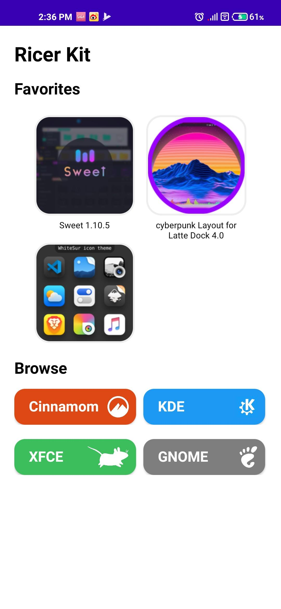
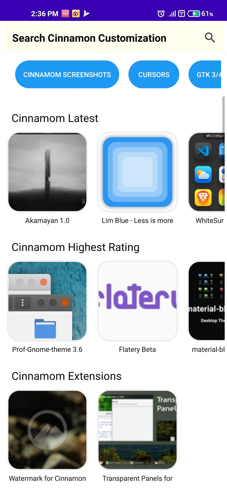
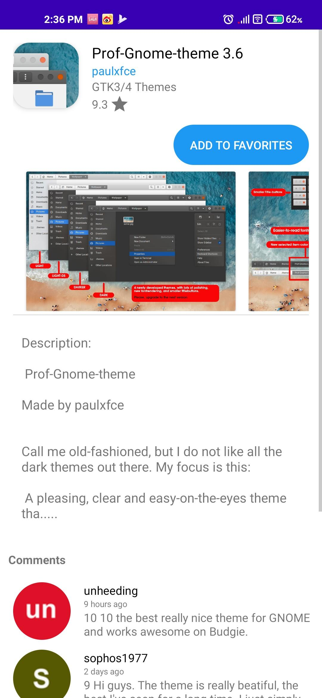
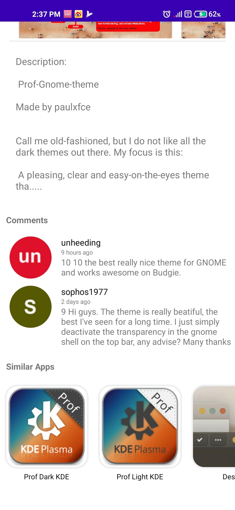
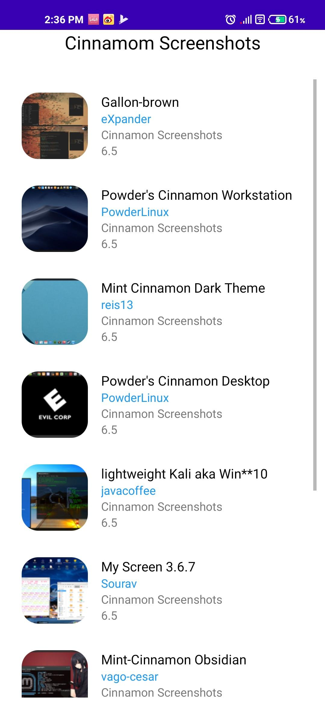

#  Ricer Kit

A free and open source android application for browsing KDE Store and other Linux Desktop Environment's Stores in Pling.
Couldn't check it in different devices so there could be some bugs. Bug Report and Feedbacks are highly appreciated.
 
<a href="https://github.com/AERegeneratel38/RicerKit/releases/download/0.8/app-debug.apk">Download</a>

## Capabilities:
- [x] Browse KDE Store, xfce-look.org, gnome-look.org and cinnamon-look.org
- [x] Check the comments on the products and access the developer's page
- [x] Add the products you like to your library!
- [x] Bad Code (:sweat_smile:)

## Screenshots:
</img>
</img>
</img>
</img>
</img>
